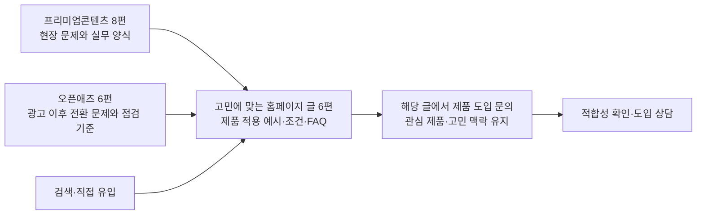

# 닥터네스트·뷰티네스트 3채널 콘텐츠·문의 퍼널 기획

기준일: 2026-09-25 · 기획안 v2 · 표현 검토 반영 · 본문 작성·공개 페이지 수정·발행 미실행

## 결론

병원 원장·상담실장과 뷰티 매장 운영자가 외부 글을 읽고 자신의 운영 문제를 살펴보게 한다. 이어지는 블링크애드 홈페이지 글에서는 제품이 어떤 업무를 도와주는지 확인하고 도입을 문의하도록 한다.

**네이버 프리미엄콘텐츠 8편 + 오픈애즈 6편 + 홈페이지 블로그 6편 = 총 20개 콘텐츠 작업**을 제안한다. 홈페이지 6편 중 5편은 기존 글 보강, 1편은 신규 글이다. 기존 20개 소재를 모두 한 번씩 배정했으며 20개를 세 채널에 각각 복제하는 60편 계획이 아니다.



독자는 프리미엄콘텐츠나 오픈애즈에서 홈페이지 글로 이동한 뒤 바로 문의할 수 있다. 두 외부 채널을 차례로 읽거나 별도 제품 소개 페이지를 더 거칠 필요는 없다.

## 1. 현재 공개 동선에서 확인한 사실

2026-09-25 공개 페이지를 직접 GET으로 조회하고 로컬 소스를 읽었다. 검색 도구의 캐시와 직접 조회 결과가 일부 달라, 게시글 존재·현황은 당일 직접 조회를 우선했다. 폼 제출이나 운영 설정 변경은 하지 않았다.

| 확인 사항 | 사실·근거 | 이번 기획에 주는 의미 |
|---|---|---|
| 홈페이지에 제품 관련 글이 이미 있음 | 닥터네스트 소개, 뷰티네스트 소개, 외국인 환자 상담 동선, 병원 알림톡, 광고→상담→예약 글 5개 모두 HTTP 200. 아래 H1·H3·H4·H5·H6의 실제 URL 참조 | 기존 URL을 연결 목적지로 활용하고 내용·CTA를 보강 |
| 제품 글의 하단 CTA가 SEO 진단으로 이어짐 | 제품 소개 글과 `/contact`에서 “우리 업장도 상위노출 가능할까?”, “내 업장 진단받기” 확인 [S1·S2·S3] | 제품 도입 관심과 문의 화면의 설명을 맞춰야 함. 이 불일치가 실제 이탈을 일으켰다는 전환 분석은 하지 않음 |
| 제품 설명에 과거 일정 표현이 남아 있음 | 제품 소개 글에 2026년 8월 말 출시 관련 문구가 남아 있음 [S2·S3] | 외부 유입을 보내기 전에 현재 상태에 맞는 소개로 정리 |
| 외부 채널과 홈페이지 연결의 선례가 있음 | 오픈애즈의 기존 블링크애드 글 본문과 끝부분에 공식 홈페이지 링크 존재 [S4] | 이번에는 홈페이지 첫 화면 대신 고민에 맞는 글을 연결. 모든 신규 글의 게재·링크 허용을 보장한다는 의미는 아님 |
| 프리미엄콘텐츠 공개 목록에서 무료 글 확인 | 당일 블링크애드 공개 목록 조회에서 무료 표시된 글 확인 [S5] | 이번 도입 유입용 8편도 무료 공개 운영을 우선 제안. 기존 판매 설정을 변경한 것은 아님 |
| 기본 유입 추적 코드 존재 | `lib/tracker.ts`에 UTM·원본 페이지·CTA 저장, `DiagnosisModal.tsx`에 문의 데이터 전송 구조 확인 [S8] | 새로 만든 추적이라고 주장하지 않고 필요한 제품·주제 구분을 보완하는 방향 |

**기획상 해석:** 지금은 유입될 글의 수뿐 아니라, 제품 글→문의 화면의 맥락을 맞추는 작업이 중요하다. 실제 전환율, 유료 구독자 규모, 채널별 문의 성과는 이번에 측정하지 않았다.

## 2. 채널별 역할

| 채널 | 이 캠페인에서 겨냥할 독자 | 글에서 완결할 내용 | 홈페이지로 이동할 이유 | 제품 노출 |
|---|---|---|---|---|
| 네이버 프리미엄콘텐츠 8편 | 상황이 익숙하고 해결 절차가 필요한 원장·실장·매장 운영자 | 구체적인 운영 장면, 판단 기준, 바로 쓸 문구·양식 | 제품을 쓰면 어떤 업무를 맡길 수 있는지 확인 | 글에서 설명한 일을 제품으로 처리하는 방법 소개 |
| 오픈애즈 6편 | 광고·콘텐츠 성과를 상담·예약까지 관리하려는 사업자·마케터 | 광고 이후 전환이 끊기는 지점, 지표·업무 연결의 점검 기준 | 실제 상담 운영에 적용할 방법과 제품의 역할 확인 | 독립적으로 유용한 글을 완성하고 관련 가이드 연결 |
| 공식 홈페이지 블로그 6편 | 제품이 자신의 병원·매장에 맞는지 알아보는 사람 | 문제 진단, 제품 적용 예시, 적합·비적합 조건, FAQ | 해당 글에서 바로 도입 문의 | 글의 핵심 질문과 맞는 제품명을 명확히 설명 |

위 독자 배분은 이번 캠페인의 편집 전략이다. 각 플랫폼 전체 이용자의 직업·구매 의도를 실측한 결과가 아니다. 모든 글은 상시형이며 검색 키워드는 미검증 후보로 다룬다.

## 3. 홈페이지 블로그 6편: 외부 글의 연결 목적지

H1~H6은 기획 관리 번호다. 아래 제목은 신규·보강 후의 제목 제안이며 현재 공개 제목으로 오인하지 않는다. 기존 URL 5개는 유지하는 방향이다.

| ID | 제목 제안 | 독자가 확인할 내용 | 바로 이어질 문의 문구 | 작업 방식·기존 소재 |
|---|---|---|---|---|
| H1 | 여러 채널로 들어오는 병원 문의, 닥터네스트로 한곳에서 받기 | 통합 상담이 필요한 상황인가? 문의 접수→초기 안내→직원 확인 흐름, 자동응대 가능 범위, 기존 업무와의 관계 | 우리 병원에 맞는지 상담받기 | 닥터네스트 소개 글 보강 / 기존 #3 |
| H2 | 닥터네스트로 상담 매뉴얼을 만들고 인수인계하는 법 | 공통 기준·이력 관리가 필요한가? 가격 문의 템플릿, 조건·예외 기준, 고객별 마지막 약속, 담당자 인계 예시 | 상담 매뉴얼·인수인계 문의하기 | 신규 후보 / 기존 #6 |
| H3 | 외국인 환자 상담에 닥터네스트를 쓴다면, 어디까지 맡길 수 있을까? | 외국인 상담에서 제품에 어떤 일을 맡길까? 기본 안내와 전문 판단 구분, 번역 확인, 영업시간 밖 접수·다음 근무 인계 | 외국인 환자 상담 기능 문의하기 | 기존 외국인 환자 상담 동선 글 보강 / 기존 #4 |
| H4 | 예약 안내부터 재방문 연락까지, 닥터네스트로 챙기는 법 | 언제 어떤 연락을 보낼까? 예약 변경 경로, 의료진이 정한 사후 안내, 다음 연락 계획과 미방문 관리 | 예약·재방문 안내 기능 문의하기 | 기존 병원 알림톡 글 보강 / 기존 #13 |
| H5 | 뷰티네스트로 DM 상담부터 다음 방문 안내까지 관리하기 | 우리 매장의 문의·기록·재방문 업무에 맞나? 사진 문의, 외국어 의사 확인, 담당자 변경, 다음 안내, 이용 중단 고객 연락 | 우리 매장에 맞는지 상담받기 | 뷰티네스트 소개 글 보강 / 기존 #10 |
| H6 | 문의는 늘었는데 예약은 그대로, 닥터네스트 도입 전에 볼 숫자 | 문제가 광고 유입에 있는지, 상담 이후에 있는지 확인. 문의당·예약당 비용 계산, 광고와 상담의 조건 확인, 제품에서 확인할 범위 | 상담·예약 관리 기능 문의하기 | 기존 병원 마케팅 전 과정 글 보강 / 기존 #17 |

### 현재 사용할 수 있는 기존 URL

- **H1** [닥터네스트 소개](https://www.blinkad.kr/blog/dagteoneseuteulan-byeong-ueon-sangdam-eul-hanalo-moeuneun-bangsig-jeongli)
- **H2** 제안 경로 `/blog/doctornest-consultation-manual-handover` — **미생성**. 본문과 문의 동선이 준비되기 전 외부 링크에 사용하지 않는다. 현재 공개 목록 조회 범위에서 같은 인수인계 전용 글은 찾지 못했으며 비공개 초안은 확인하지 않았다.
- **H3** [외국인 환자 상담 동선](https://www.blinkad.kr/blog/oigug-in-hoanja-yuchi-google-maps-mun-euileul-silje-yeyag-eulo-bakkuneun-sangdam-dongseon)
- **H4** [병원 알림톡](https://www.blinkad.kr/blog/3-opeun-aejeu-byeong-ueon-allimtog-yeyagsisul-hujaebangmun-mesijineun-eonje-bonaeya-halkka)
- **H5** [뷰티네스트 소개](https://www.blinkad.kr/blog/byutineseuteulan-miyongsilneilsyab-sangdamgoa-jaebangmun-eul-han-hoamyeon-eseo-boneun-bangsig)
- **H6** [광고→상담→예약→재방문](https://www.blinkad.kr/blog/byeong-ueon-maketing-goanggo-yuib-eul-sangdamyeyagjaebangmun-eulo-yeongyeolhaneun-bangbeob)

기존 주소에 본문을 보강하되 외부 글이 약속한 예시를 찾기 쉽게 해당 절로 연결한다. `#after-hours`, `#foreign-style`, `#revisit`, `#measurement` 등의 절 ID는 **추가 제안**이며 현재 존재한다고 확인한 것이 아니다.

H5는 뷰티네스트 도입 판단을 위한 대표 글이다. 외국어 스타일 상담, 고객 기록, 재방문·미방문 연락은 목차로 구분하고 유입된 독자가 관련 절부터 볼 수 있게 한다. 결제·관리권 잔액·자동 사진 분석까지 지원한다고 확장하지 않는다.

## 4. 네이버 프리미엄콘텐츠 8편: 현장 문제와 실행 방법

| ID·기존 번호 | 제목 | 글에 담을 내용 | 연결 글 | 외부 글 끝의 CTA 제안 |
|---|---|---|---|---|
| P1 · #2 | 퇴근 후 들어온 외국인 환자 문의, 아침에 답해도 괜찮을까? | 야간 안내문·기본 확인 항목·다음 근무 인계표 | H3 | 야간 문의에 답하고 다음 직원에게 넘기는 방법 보기 |
| P2 · #7 | 실장님이 퇴사하면, 진행 중인 환자 상담은 누가 이어받을까? | 마지막 문의·약속·다음 연락을 남기는 인수인계 양식 | H2 | 상담 기록을 남기고 인수인계하는 방법 보기 |
| P3 · #8 | 원하는 머리 사진까지 보냈던 손님은 왜 예약하지 않았을까? | 희망 스타일→현재 상태→일정 상담의 질문 흐름 | H5 · 사진 문의 절 | 사진 DM 상담을 예약으로 이어가는 방법 보기 |
| P4 · #9 | 외국인 손님과 번역기로 대화했는데 원하는 스타일은 서로 다르게 이해했다면 | 사진·길이·컬러·과거 시술을 재확인하는 질문표 | H5 · 외국어 상담 절 | 번역한 답변과 고객 요청을 확인하는 방법 보기 |
| P5 · #12 | 시술 후 안내문을 줬는데도 같은 질문을 다시 받는다면 | 한 번에 전달할 내용과 시점별 후속 안내의 구분 | H4 · 사후관리 절 | 시술 후 안내 메시지 예시 보기 |
| P6 · #14 | 네일·왁싱 손님에게 “다음에 또 오세요”만 말하고 있나요? | 고객별로 다음에 연락할 때를 적어두는 표 | H5 · 다음 방문 절 | 다음 방문 안내를 챙기는 방법 보기 |
| P7 · #15 | 피부관리권을 끊고 안 오는 손님에게는 뭐라고 연락해야 할까? | 왜 이용을 멈췄는지 묻는 문구와 다음 약속을 남기는 방법 | H5 · 미방문 연락 절 | 한동안 오지 않은 손님에게 연락하는 방법 보기 |
| P8 · #20 | AI가 답해도 되는 질문, 직원이 직접 답해야 하는 질문 | 자동 안내·직원 확인·전문 판단을 구분하는 표 | H1 · 자동응대 범위 절 | AI가 답할 내용과 직원이 확인할 내용 살펴보기 |

**공개 방식 제안:** 이번 8편은 서비스 도입 유입이 목적이므로 무료 공개를 우선 권한다. 유료 운영을 유지한다면 무료 영역에서 문제·핵심 답변·제품 적용 가이드 링크를 제공하고 유료 본문에는 전체 양식·문구·상세 해설을 완결해 제공한다. 결제했는데 핵심 답을 홈페이지에서 다시 찾아야 하는 구조는 피한다. 네이버 공식 작성 가이드의 무료 공개 범위·무료 프로모션 설명을 확인했다 [S6]. 실제 판매 설정은 변경하지 않았다.

## 5. 오픈애즈 6편: 광고 이후의 전환 문제

| ID·기존 번호 | 제목 | 글에 담을 내용 | 연결 글 | 외부 글 끝의 CTA 제안 |
|---|---|---|---|---|
| O1 · #1 | 문의에 답했더니 “다른 병원 예약했어요”라는 말을 들었다면 | 문의 발생 이후 첫 응대와 다음 단계의 점검 기준 | H1 | 여러 채널의 문의에 답하는 과정 살펴보기 |
| O2 · #5 | “얼마예요?”에 가격을 보냈는데 그 뒤로 답이 없다면 | 가격 안내 뒤 목적·일정·다음 절차를 확인하는 대화 예시 | H2 · 가격 문의 절 | 가격 문의 답변 예시 보기 |
| O3 · #11 | 예약은 늘었는데 실제 방문은 그대로, 광고 성과를 어떻게 봐야 할까? | 예약과 방문의 집계를 구분하고 안내·변경 연락 점검 | H4 · 예약 확인 절 | 예약 확인·변경 안내 방법 보기 |
| O4 · #16 | 단골과 처음 온 손님에게 같은 이벤트 문자를 보내고 있나요? | 신규·이용 중·장기 미방문 고객의 메시지 목적 비교 | H5 · 고객별 메시지 절 | 고객별 안내 문구 예시 보기 |
| O5 · #18 | 인플루언서 영상 조회수는 높은데 병원 예약은 왜 늘지 않을까? | 콘텐츠→문의→상담→예약 단계의 평가표 | H6 · 캠페인 평가 절 | 문의 수와 예약 수를 함께 보는 방법 보기 |
| O6 · #19 | 광고에는 된다는데 상담실에서는 왜 안 된다고 할까? | 광고 조건·상담 기준·변경 전달을 맞추는 양식 | H6 · 광고와 상담 조건 절 | 광고 내용과 상담 안내를 맞추는 방법 보기 |

오픈애즈에서는 개별 글 안에서 문제의 답과 점검 방법을 완결한다. 홈페이지 링크는 제품 적용 범위를 더 살펴볼 사람의 다음 단계다. O3은 기존 오픈애즈 병원 알림톡 발송 시점 글과 겹치지 않도록, **예약 수와 실제 방문 성과를 구분하는 마케팅 측정 문제**에 집중한다.

## 6. 홈페이지 글에서 문의까지 이어지는 구성

각 글의 첫 문단에는 독자가 외부 글에서 읽고 넘어온 문제를 짚는다. 권장 순서는 다음과 같다.

1. **이 글이 해결하는 상황과 결론.** 예: 여러 메신저에서 온 문의를 놓치는 병원이 통합 상담을 검토할 때 확인할 것.
2. **문의 버튼을 바로 제공.** 읽기 전에 상담할 준비가 된 독자는 곧바로 문의할 수 있게 한다.
3. **제품 적용 예시.** 초기 안내→직원 확인→기록 등 실제로 설명 가능한 운영 흐름. 검증된 화면이 없다면 화면을 꾸며내지 않고 설명용 도식으로 표시한다.
4. **직접 운영할 일과 제품이 돕는 일을 구분.** 매뉴얼 승인·전문 판단·고객 의사 확인은 운영자의 역할임을 보여준다.
5. **어떤 사업장에 맞는지·무엇을 지원하는지·FAQ.** 기존 차트·예약 도구와의 관계, 사용할 채널, PC 이용 환경 등 확인된 조건.
6. **같은 제품·같은 고민으로 문의.** 본문 아래 또는 같은 페이지의 폼·모달로 연결한다.

### 문의 문구와 입력

- 병원용 기본 버튼: **닥터네스트 도입 상담받기**
- 뷰티용 기본 버튼: **뷰티네스트 도입 상담받기**
- 글마다 H1~H6 표의 구체적인 문구를 사용할 수 있으나 상담 접수 목적은 같게 유지한다.
- 폼 설명 제안: **어떤 상담 채널을 쓰고 계신지, 어떤 업무가 불편한지 알려주세요. 제품으로 도와드릴 수 있는 일을 안내해 드립니다.**
- 권장 필수 입력: 사업장명·담당자명·연락처. 선택 입력: 현재 쓰는 채널·가장 불편한 업무. 질문을 길게 늘리지 않는다.
- 관심 제품과 읽던 글의 주제를 미리 선택해 보여준다. 독자가 바꿀 수도 있게 한다. 공개 URL·분석 이벤트에는 이름·전화번호 등 개인정보를 넣지 않는다.
- 자료 열람·템플릿 다운로드는 제품 도입 문의와 별도로 집계한다. 자료를 보려는 사람을 자동으로 영업 문의자로 취급하지 않는다.
- 문의 접수 뒤에는 접수 완료와 다음 절차를 안내한다. 응답 소요시간은 실제 운영 가능한 기준을 확정한 뒤 표시한다.

### 현재 동선과 변경 제안의 구분

- 현재 `/contact`는 SEO 무료 진단 화면이다. 이번에 해당 화면을 수정하지 않았다.
- 우선 권장안은 **제품 관련 글 안에서 제품용 문의 폼·모달을 여는 것**이다. 연락을 원하는 독자가 다른 글이나 서비스 목록을 더 거치지 않게 한다.
- 별도 주소를 사용할 경우 `/contact?service=doctornest&topic=h1` 같은 방식으로 맥락을 전달할 수 있으나, 이는 **설계 예시**다. 현재 코드는 이 매개변수에 맞춘 제품 화면 전환을 제공한다고 확인되지 않았다.
- 현재 `source="premium_content_contact"`라는 고정값이 연락 페이지에 사용되고 있다. 해당 문자열만 보고 모든 문의를 프리미엄콘텐츠 유입으로 집계하지 않는다.

## 7. 집필 브리프와 근거의 승계

원 기획의 독자 상황·직접 답변·H2·FAQ·제품 근거·금지사항은 [이전 20개 집필 브리프](../../닥터네스트_뷰티네스트_프리미엄콘텐츠_20개_기획_20260925.md)를 함께 사용한다. **채널·제목·CTA·연결 목적지는 이번 v2가 우선**한다. 홈페이지 6편은 아래 범위로 다시 쓴다.

| ID | 핵심 질문·키워드 후보 | 직접 답변 | H2 질문 | FAQ 후보 | 근거·제외 범위 |
|---|---|---|---|---|---|
| H1 | 통합 상담이 우리 병원에 필요한가? / 닥터네스트 통합상담 | 문의가 여러 채널에 흩어지고 응답 확인이 어려운 병원은 통합 화면과 초기 안내를 검토할 수 있다. 전문 판단과 예외 답변은 담당자가 확인한다. | 어느 단계에서 문의를 놓치나? 통합 후 업무는 어떻게 이어지나? AI 안내는 어디까지인가? | 기존 차트를 바꾸나? 연결할 채널은? 답변이 어려운 질문은? | PDF 3·6쪽, 기존 제품 팩트시트, 현재 소개 글. 누락 0·예약 보장 금지 |
| H2 | 상담 기준과 인계 기록을 어떻게 맞출까? / 병원 상담 매뉴얼 | 공통 답변 조건과 고객별 마지막 약속을 함께 기록해야 다음 담당자가 대화를 이어갈 수 있다. 제품은 매뉴얼·기록 관리에 연결하며 자동 견적이나 인수인계 완료를 보장하지 않는다. | 가격 안내 조건은 어떻게 통일하나? 예외는 어떻게 남기나? 다음 담당자는 무엇을 확인하나? | 행사 조건이 바뀌면? 메모는 언제 쓰나? 과거 대화는 어떻게 확인하나? | PDF 6·8~9쪽. 자동 견적·자동 직원 배정 기능 미확인 |
| H3 | 외국인 문의의 담당자 공백을 어떻게 줄일까? / 외국인 환자 상담 | 확인된 기본 안내는 번역과 초기 응대를 활용하고 전문 확인이 필요한 내용은 담당자에게 넘기는 운영을 제안한다. 영업시간 밖에는 다음 응대 절차를 명확히 안내한다. | 문의가 어디서 들어오나? 무엇을 번역해 안내하나? 다음 근무자는 어떻게 이어받나? | 통역을 대체하나? 야간 예약을 확정하나? 다른 언어로 바뀌면? | PDF 3·6쪽, 기존 팩트시트. 통역 완전 대체·예약 자동 확정·위챗/구글 예약 연동 소구 제외 |
| H4 | 어떤 후속 안내를 어떤 시점에 운영할까? / 병원 알림톡 재방문 | 예약 안내·사후관리·재방문 연락은 목적을 구분하고 병원이 정한 기준에 따라 설계한다. 발송 자체와 실제 확인·예약·방문은 구분해 점검한다. | 예약 안내 뒤 무엇을 확인하나? 사후관리 내용은 누가 정하나? 다음 연락은 어떻게 기록하나? | 모든 환자에게 같은 간격인가? 변경 요청이 오면? 답이 없으면? | PDF 3·7~9쪽. 의학적 일정의 일률 적용·노쇼 감소 보장 금지 |
| H5 | 뷰티네스트가 우리 매장 업무에 맞을까? / 뷰티네스트 고객관리 | 문의가 분산되고 담당자별 기록과 후속 안내가 끊기는 매장은 상담·이력·다음 연락 업무를 검토할 수 있다. 예약장부·결제·관리권 잔액 관리까지 대체한다고 설명하지 않는다. | DM·외국어 문의를 어떻게 이어가나? 다음 담당자에게 무엇을 남기나? 재방문·미방문 연락은 어떻게 나누나? | 폰만으로 쓸 수 있나? 관리권 잔액도 관리하나? 기존 예약 도구를 바꾸나? | 기존 뷰티 기획·현재 제품 소개. 최신 기능을 운영 계정에서 시험한 것은 아니며 PC·지원 채널 등 변동 조건은 현재 범위 확정 후 기재 |
| H6 | 광고 이후의 문제를 어떤 지표로 찾을까? / 문의당 비용 예약당 비용 | 같은 기간의 문의와 예약을 구분하고 중간 단계가 어디서 끊기는지 본다. 광고 조건과 상담 답변의 차이도 확인하며 모든 성과가 자동 집계된다고 단정하지 않는다. | 문의·예약은 어떻게 정의하나? 비용을 어떻게 계산하나? 광고와 상담의 조건은 맞나? | 중복 문의는? 예약이 0이면? 유입 출처를 모르면? | PDF 2·4~6쪽. 계산표는 콘텐츠 실무 자료이며 제품의 실제 대시보드 항목과 구분 |

O3은 이전 #11의 예약 확인 주제에서 **마케팅 평가 지표의 결정**으로 관점을 바꾼다. 직접 답변: 예약 건수와 실제 방문 건수를 같은 성과로 취급하지 않고 별도로 확인한다. 방문하지 않은 이유는 안내·변경 경로·고객 상황을 확인해야 하며 발송 기능만으로 원인을 단정하지 않는다. H2: 예약과 방문의 집계는 어떻게 다른가? 어느 시점의 연락을 점검하나? 광고 보고서에 무엇을 추가하나? FAQ: 취소는 어디에 넣나? 예약일과 방문일이 다르면? 고객 답변이 없으면?

프리미엄·오픈애즈의 나머지 13개는 이전 브리프의 직접 답변·H2·FAQ를 해당 기존 번호로 승계한다. 독자 상황은 이번 표의 업종으로 맞추며 CTA는 홈페이지 적용 가이드로 교체한다.

## 8. 성과 측정: 홈페이지 방문 이후를 본다

목표는 **제품 도입에 적합한 문의**다. 외부 글의 조회·좋아요는 보조 지표로 사용한다.

| 단계 | 볼 항목 | 해석 |
|---|---|---|
| 외부 콘텐츠 | 글별 확인 가능한 조회·링크 클릭 | 플랫폼에서 제공되는 범위만 기록 |
| 홈페이지 도착 | 채널·글별 식별 가능한 방문 세션 | 외부 글별로 UTM을 구분해 어떤 주제가 사람을 데려왔는지 확인 |
| 문의 의사 | 제품 문의 버튼 클릭·폼 시작 | 클릭 자체를 문의 완료로 세지 않음 |
| 문의 접수 | 중복·실패를 구분한 제출 성공 | 정상 접수된 문의 수 |
| 유효 문의 | 업종·관심 업무·도입 조건이 맞는 상담 | 광고 제휴·오접수·중복과 구분, 담당자 확인 |
| 후속 결과 | 상담 진행·도입 결정 | 원 콘텐츠와 가능한 범위에서 연결해 편집 우선순위 판단 |

**권장 비교 지표:** 홈페이지 도착 세션 대비 정상 문의 접수율, 정상 문의 중 유효 문의 비율, 글별 유효 문의 수. 분모가 작을 때 소수 문의의 비율 차이를 채널 우열로 단정하지 않는다. 목표 전환율·예상 문의 수는 근거 없이 제시하지 않는다.

추적값 예시:

```text
프리미엄 P1 외부 링크:
utm_source=naver_premium
utm_medium=referral
utm_campaign=nest_content_202609
utm_content=p01_footer

오픈애즈 O1 외부 링크:
utm_source=openads
utm_medium=referral
utm_campaign=nest_content_202609
utm_content=o01_footer
```

실제 기존 H1 URL에 붙인 예시:

`https://www.blinkad.kr/blog/dagteoneseuteulan-byeong-ueon-sangdam-eul-hanalo-moeuneun-bangsig-jeongli?utm_source=openads&utm_medium=referral&utm_campaign=nest_content_202609&utm_content=o01_footer`

UTM은 외부→홈페이지 링크에서 구분하고 홈페이지 내부 이동에는 새 캠페인 값을 덧씌우지 않는 설계다. 폼 접수에는 외부 원글 ID, 홈페이지 글 ID, 제품, 고민 항목을 함께 남긴다. 기존 코드는 `utm_content`를 저장하는 부분이 있지만 명시적인 문의 전송 필드에는 빠져 있어, 글별 집계에 쓰려면 전달·보관까지 점검해야 한다 [S8]. 현재 추적이 끝까지 검증됐다고 주장하지 않는다. 앱 내 브라우저·추적 차단·재방문에 따른 출처 누락도 가능하다.

## 9. 제작·발행 순서

1. **홈페이지 H1·H5 보강 + 제품에 맞게 문의 문구 수정.** 병원·뷰티 독자가 처음 읽을 홈페이지 글과 문의 폼을 준비한다.
2. **홈페이지 H2 신규 작성 + H3·H4·H6 보강.** 기존 문구의 현재성·지원 범위, 외부 글과의 내용 일치 확인.
3. **외부 1차 P3·P2·O1·O2.** 미용실 사진 DM, 상담 인계, 첫 응답, 가격 문의 등 바로 이해되는 문제로 시작한다. 각각 H5·H2·H1·H2로 연결한다.
4. **외부 2차 P1·P4·P5·O3·O5.** 외국어·사후관리·예약과 방문·인플루언서 성과 확장.
5. **외부 3차 P6·P7·P8·O4·O6.** 재방문·미방문·AI 응대 범위·고객별 메시지·광고 조건으로 확장.

고정 날짜와 발행 빈도는 정하지 않았다. 목적지와 해당 CTA가 준비된 글부터 외부에 발행하는 순서다. 조회가 높은 글뿐 아니라 유효 문의를 만든 주제부터 후속 콘텐츠를 늘린다.

## 10. 확인 한계·금지 사항

- 이번 수량 배분과 발행 순서는 편집 제안이며 채널별 실측 전환 성과에 근거한 최적값은 아니다.
- 외부 채널의 전체 과거 발행·비공개 초안·편집 승인 상태를 전수 조사한 것은 아니다. 공개 대표 목록과 관련 글, 기존 기획을 대조했다.
- 사용자 지정 상품설명서와 2026-08-12 팩트시트의 위챗·구글 예약 지원 상태 충돌은 해소되지 않았다. 이번에도 기능 소구에서 제외했다.
- 공개 제품 소개가 존재하는 것은 확인했지만 현재 운영 계정의 제품 기능을 시험한 것은 아니다. 오래된 출시 문구를 최신 상태로 간주하지 않는다.
- ‘1분 넘으면 이탈’, 일정 전환율, 노쇼 감소, 매출 증가를 보장하지 않는다. 가격·단가·내부 영업 정보는 콘텐츠에서 제외한다.
- AI가 의료 판단·전문 통역을 대체한다고 쓰지 않는다. 병원 안내 일정은 의료진 기준에 따른다.
- 홈페이지 문의 UI, 추적값, 제안된 절 ID·H2 신규 경로는 이번에 구현하지 않았다.
- 폼의 정상 전송·실제 수신·분석 도구의 이벤트 기록은 이번 읽기 조사에서 시험하지 않았다.
- 기존 context·Notion 작업큐는 변경하지 않았다.

## 11. 출처·검증 기록

- **S1** [현재 문의 페이지](https://www.blinkad.kr/contact): SEO 무료 진단 문구·폼 항목 확인. 직접 GET HTTP 200.
- **S2** [닥터네스트 소개](https://www.blinkad.kr/blog/dagteoneseuteulan-byeong-ueon-sangdam-eul-hanalo-moeuneun-bangsig-jeongli): 제품 소개·과거 출시 문구·하단 CTA. 직접 GET HTTP 200.
- **S3** [뷰티네스트 소개](https://www.blinkad.kr/blog/byutineseuteulan-miyongsilneilsyab-sangdamgoa-jaebangmun-eul-han-hoamyeon-eseo-boneun-bangsig): 제품 소개·과거 출시 문구·하단 CTA. 직접 GET HTTP 200.
- **S4** [오픈애즈 기존 블링크애드 글](https://www.openads.co.kr/content/contentDetail?contsId=19439): 공식 홈페이지로 연결하는 본문·하단 링크 확인. [인사이터 목록](https://www.openads.co.kr/insighter/insighterDetail?authorId=740) 직접 GET HTTP 200.
- **S5** [네이버 프리미엄콘텐츠 공개 목록](https://contents.premium.naver.com/blinkad/blink/contents): 직접 GET HTTP 200, 무료 표시 글 확인. 검색 도구에서는 본문 수집 오류가 있어 직접 조회를 사용함.
- **S6** [네이버 프리미엄콘텐츠 공식 작성 가이드](https://naver-premiumcontents.gitbook.io/guide/chapter2/page1): 무료 공개 범위·판매 설정·무료 프로모션 구분.
- **S7** [Google Analytics 캠페인 URL 공식 안내](https://support.google.com/analytics/answer/10917952?hl=ko): UTM 소스·매체·캠페인·콘텐츠 구분의 근거.
- **S8** 로컬 현재 `main`의 `components/DiagnosisContactPage.tsx`, `components/DiagnosisModal.tsx`, `lib/tracker.ts`: 문의 화면·필드·UTM 전달 범위 읽기 확인. 자격증명·전송 주소는 이 보고서에 복사하지 않음.
- **S9** [원 20개 기획](../../닥터네스트_뷰티네스트_프리미엄콘텐츠_20개_기획_20260925.md): 지정 PDF 12쪽 확인 기록·제품 근거·기존 52개 기획·주제별 브리프.

직접 조회 요약 원본은 작업 임시 폴더 `/tmp/nest-funnel-20260925/verified-pages.json`에 저장했다. 향후 삭제될 수 있는 임시 자료이므로 필수 판단 근거와 실제 URL은 본 문서에 모두 기재했다. 작업 기록은 기존 Issue #235에 이어 남긴다.
