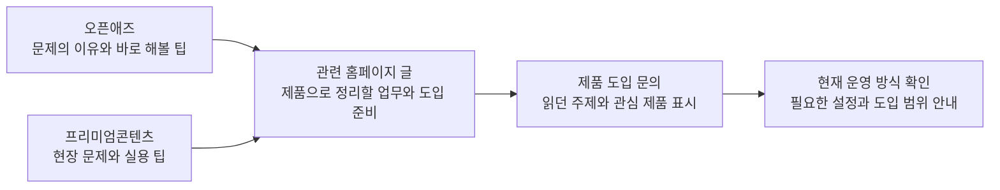

# 오픈애즈에서 홈페이지 도입 문의까지: 주제와 연결 문구

후속 작업: 홈페이지 집필·문의 화면 구현과 최신 연결 상태는 [운영 반영 기록](NEST_HOMEPAGE_FUNNEL_IMPLEMENTATION_20260926.md)을 확인한다. 아래 내용은 기획·교정 당시 기록이다.

2026-09-26 · 기획 v3 · 홈페이지 본문 집필·문의 UI 구현·공개 발행 전

병원 원장·상담실장·마케터와 뷰티 매장 운영자가 오픈애즈에서 발견한 운영 문제를 홈페이지에서 자신의 업무에 대입하고, 닥터네스트 또는 뷰티네스트 도입 상담을 신청하도록 돕는 6개 콘텐츠다.

이번 문서가 이전 `NEST_CONTENT_FUNNEL_PLAN_20260925.md`의 홈페이지 제목·연결·문의 문구보다 우선한다. 기존 H1~H6 번호와 공개 URL은 유지한다. 가격 문의 O2와 광고 조건 O6는 H2의 공통 상담 기준이라는 한 가지 결정으로 묶는다. 오픈애즈의 직접 목적지는 5개이고, H3는 이미 작성한 프리미엄 외국인 상담 글의 목적지로 남긴다. 같은 내용을 나눠 홈페이지 글 수를 늘리지 않는다.

## 독자가 이동할 때마다 확인할 내용

오픈애즈 글에서 질문의 답은 충분히 제공한다. 홈페이지에서는 같은 설명을 되풀이하기보다 실제로 정리할 기록, 제품이 돕는 업무, 도입할 때 함께 확인할 조건을 보여준다. 홈페이지 글 안에서 바로 제품 문의를 열고, 제품 소개를 또 찾아 읽게 만들지 않는다.

## 주제별 연결표

| 홈페이지 | 제목 | 들어오는 글 | 홈페이지에서 추가로 얻는 정보 | 문의 버튼 |
| --- | --- | --- | --- | --- |
| H1 · 기존 소개 보강 | 카카오톡·DM으로 흩어진 병원 문의, 한곳에서 관리하려면 | O1 첫 답변 / P8 자동 응대 | 문의를 모은 뒤 기본 안내·직원 확인·기록을 어떻게 나눌지, 도입 상담에서 확인할 채널과 응대 환경 | 우리 병원 문의 관리 상담하기 |
| H2 · 신규 | 가격·행사 안내가 직원마다 다를 때, 상담 기준을 맞추는 방법 | O2 가격 문의 / O6 광고 조건 / P2 인수인계 | 공통 답변 조건, 고객에게 이미 안내한 내용, 변경된 행사 기준을 어디에 구분해 남길지 | 상담 안내 정리 문의하기 |
| H3 · 기존 글 보강 | 외국인 환자 문의, 번역부터 다음 상담까지 어떻게 이어갈까? | P1 야간 외국인 문의 | 원문과 번역 확인, 기본 안내, 담당자에게 넘길 내용, 현재 쓰는 채널의 연결 가능 여부 | 외국인 상담 운영 문의하기 |
| H4 · 기존 알림톡 글 보강 | 예약 확인·변경 연락을 놓치지 않으려면 무엇을 정리해야 할까? | O3 예약과 방문 / P5 사후 안내 | 기존 예약 기록과 문의 기록을 함께 확인하는 순서, 변경 연락을 받은 뒤 후속 안내를 점검할 담당과 시점 | 예약 후 안내 상담하기 |
| H5 · 기존 뷰티 소개 보강 | 뷰티 매장 고객관리, 상담 기록과 다음 안내를 함께 챙기는 법 | O4 고객별 행사 / P3·P4·P6·P7 | 손님별 상담·시술 기록을 보고 안내 대상을 고르는 방법, 뷰티네스트가 맡을 업무와 도입 준비 | 우리 매장 고객관리 상담하기 |
| H6 · 기존 마케팅 글 보강 | 광고로 들어온 문의, 예약까지 어디에 기록해야 할까? | O5 인플루언서 성과 | 광고 쪽 유입 기록과 병원 상담 기록을 연결해 볼 최소 항목, 출처 미상·중복 문의·예약 확인의 처리 기준 | 광고 문의 관리 상담하기 |

모두 상시형이다. 특정 행사 가격·할인율·매출 증가 수치는 넣지 않는다. 아래 키워드는 검색량을 실측하지 않은 후보이며, 이번에는 외부 글의 후속 질문과 현재 제품 소개를 기준으로 기획했다.

## H1 집필 브리프

- **타깃·상황:** 국내 병원의 상담실장이 카카오톡과 DM 등을 번갈아 확인하면서 답변 누락 여부를 다시 찾고 있다. 통합 상담을 도입할지 결정하려 한다.
- **질문·의도:** 우리 병원의 문의를 한곳에서 관리할 필요가 있는가? 비교·선택. 키워드 후보: `병원 통합 상담`, `닥터네스트 문의 관리`.
- **직접 답변:** 문의를 모아도 기본 안내와 직원이 확인할 내용을 정해두어야 상담을 이어갈 수 있습니다. 닥터네스트의 채널 통합·등록 안내·상담 기록을 병원의 현재 응대 방식에 어떻게 적용할지 살펴보고 도입 범위를 정합니다.
- **H2:** ① 지금 어느 채널의 답변을 다시 확인하고 있나요? ② 문의를 모은 뒤 직원은 무엇을 확인하나요? ③ 기본 안내와 직원 확인은 어떻게 나누나요? ④ 도입 상담 전에 무엇을 준비하면 되나요?
- **추가 질문 후보:** 기존 차트를 바꿔야 하는가? 필요한 채널이 연결되는가? PC로 응대할 자리가 있는가? 본문에서 답하고 별도 FAQ를 의무적으로 붙이지 않는다.
- **근거·제품 연결:** S1의 통합 문의·등록 안내·계정 내 상담 기록·기존 차트와의 역할 구분. 안내 문구 설정과 사용법 안내도 S1에 안내된 도입 범위다.
- **제외·확인:** 누락 0건, 응답 시간 단축률, 예약 증가, 자동 담당 배정은 쓰지 않는다. 최신 채널 연결 조건과 사용 환경은 도입 상담에서 확인할 항목이다.
- **마지막 문단:** “여러 채널을 확인하느라 답변 여부를 다시 찾고 있다면 현재 쓰는 채널과 응대 인원을 알려주세요. 닥터네스트로 모아볼 문의와 직원이 직접 확인할 내용을 정리해 드리겠습니다.”
- **문의 맥락:** 제품 `doctornest`, 고민 `inbox`, 홈페이지 `h1`.

## H2 집필 브리프

- **타깃·상황:** 국내 병원 상담실장이 가격·행사 조건을 여러 자료에서 찾아 안내하고 있다. 공통 기준과 고객별 상담 기록을 정리할지 결정하려 한다.
- **질문·의도:** 같은 기준으로 답하려면 무엇을 함께 관리해야 하는가? 비교·선택. 후보: `병원 상담 매뉴얼`, `병원 가격 안내 관리`.
- **직접 답변:** 공통으로 쓰는 가격·행사 조건과 고객에게 이미 안내한 내용은 구분해 남겨야 합니다. 병원이 승인한 안내를 준비하고 상담 기록과 함께 확인할 수 있도록 도입 범위를 정하면, 다음 담당자가 무엇을 확인해야 하는지 알 수 있습니다.
- **H2:** ① 가격·행사 안내에 어떤 조건을 함께 적어야 하나요? ② 공통 안내와 고객별 약속은 어떻게 나누나요? ③ 행사 조건이 바뀌면 어떤 자료를 함께 확인하나요? ④ 닥터네스트 도입 상담에서 무엇을 확인하나요?
- **추가 질문 후보:** 이미 안내한 고객에게는 어떻게 설명하는가? 예외 조건은 누가 승인하는가? 다음 직원은 어떤 기록을 확인하는가? 짧게 본문에 흡수한다.
- **근거·제품 연결:** S1의 등록 안내·상담 이력·안내 문구 설정 범위. 조건표와 변경 승인 절차는 병원이 정할 운영 방식이며 별도 제품 기능처럼 묘사하지 않는다.
- **제외·확인:** 자동 견적, 광고와 상담 문구 자동 동기화, 버전 승인 기능, 예외 자동 판단은 확인되지 않았으므로 제외한다. 상품설명서의 매뉴얼·메모 개념을 실제 버튼·화면 경로로 지어내지 않는다.
- **마지막 문단:** “직원마다 다른 자료를 찾아 답하고 있다면 현재 안내 자료와 자주 설명이 엇갈리는 항목을 알려주세요. 공통 안내와 고객별 기록을 어떻게 나눌지부터 상담하실 수 있습니다.”
- **문의 맥락:** 제품 `doctornest`, 고민 `consultation_guidance`, 홈페이지 `h2`. O2/O6 원글 ID는 별도로 보존한다.

## H3 집필 브리프

- **타깃·상황:** 외국인 문의를 받는 국내 병원 담당자가 번역과 다음 근무자의 후속 답변을 함께 챙겨야 한다. 어떤 안내를 도구에 맡길지 결정하려 한다.
- **질문·의도:** 외국어 문의의 기본 안내와 직원 확인을 어떻게 나눌 것인가? 비교·선택. 후보: `외국인 환자 상담 관리`, `닥터네스트 번역`.
- **직접 답변:** 외국어 문의도 기본 안내를 보낸 뒤 담당자가 확인할 질문이 남을 수 있습니다. 닥터네스트에서 원문과 번역을 함께 확인하고, 이미 안내한 내용과 남은 질문을 기록해 다음 상담으로 이어갑니다. 진료 판단과 개별 조건 확인은 담당자가 맡습니다.
- **H2:** ① 어떤 채널과 언어로 문의가 들어오나요? ② 기본 안내로 답할 내용은 무엇인가요? ③ 다음 담당자는 무엇을 다시 확인하나요? ④ 도입 상담에서 연결 조건을 어떻게 확인하나요?
- **추가 질문 후보:** 통역을 대신하는가? 야간 예약도 바로 확정하는가? 번역이 모호하면 무엇을 확인하는가? 실제 안내 범위 안에서 본문에 답한다.
- **근거·제품 연결:** S1의 번역·원문·등록 안내·상담 기록, S3의 기존 외국인 문의 흐름. 의료 판단은 기능 설명에서 제외한다.
- **제외·확인:** 통역 완전 대체, 모든 언어 정확도 보장, 예약 자동 확정, 위챗·구글 예약 연동은 제외한다. 최신 지원 조건과 PC 응대 환경은 도입 시 확인한다.
- **마지막 문단:** “번역한 대화와 다음 직원이 할 일을 따로 정리하고 있다면 사용하는 채널과 주로 들어오는 언어를 알려주세요. 기본 안내와 담당자 확인을 어디서 나눌지 함께 정리하겠습니다.”
- **문의 맥락:** 제품 `doctornest`, 고민 `foreign_consultation`, 홈페이지 `h3`.

## H4 집필 브리프

- **타깃·상황:** 병원 상담실장이 예약 변경 요청을 메신저로 받고 예약 장부를 따로 확인한다. 예약 후 연락을 정리할지 결정하려 한다.
- **질문·의도:** 예약 확인·변경·후속 안내를 어떻게 이어갈 것인가? 비교·선택. 후보: `병원 예약 변경 안내`, `예약 후 연락 관리`.
- **직접 답변:** 예약이 바뀌면 실제 예약 기록과 이후 보낼 안내를 함께 확인해야 합니다. 병원이 정한 안내 내용을 정해진 시점에 보내는 기능을 검토하되, 변경 사항 반영과 실제 방문 확인은 어떤 기록에서 누가 맡을지 먼저 정합니다.
- **H2:** ① 예약 변경은 어느 채널로 받나요? ② 기존 예약 기록과 상담 기록은 누가 맞추나요? ③ 예약 전후 안내를 언제 다시 확인하나요? ④ 현재 예약 방식과 함께 쓰려면 무엇을 확인하나요?
- **추가 질문 후보:** 일정이 바뀌면 기존 안내는 어떻게 처리하는가? 방문 결과는 어디서 확인하는가? 시술 후 안내 내용은 누가 정하는가? 미확인 제품 동작은 단정하지 않는다.
- **근거·제품 연결:** S1의 예약 확인·준비사항·사후 안내·재방문 메시지, S4의 현재 관련 글. 기록 확인 순서는 운영 제안이다.
- **제외·확인:** 예약 도구 자동 연동, 변경 시 예약 메시지 자동 취소, 실제 방문 자동 판별, 노쇼 감소 보장을 쓰지 않는다. 개별 진료 이후 안내 시점·내용은 병원 기준을 따른다.
- **마지막 문단:** “예약 변경을 받은 뒤 장부와 안내 메시지를 따로 확인하고 있다면 지금 쓰는 예약 방식과 연락 채널을 알려주세요. 예약 후 안내에서 필요한 설정과 확인 절차를 상담해 드리겠습니다.”
- **문의 맥락:** 제품 `doctornest`, 고민 `appointment_followup`, 홈페이지 `h4`.

## H5 집필 브리프

- **타깃·상황:** PC로 상담을 관리하는 국내 뷰티 매장 운영자가 고객 기록을 찾은 뒤 행사·다음 방문 안내를 고른다. 기록과 후속 안내를 함께 관리할지 결정하려 한다.
- **질문·의도:** 손님별 기록을 보고 다음 안내를 정하는 데 뷰티네스트가 맞는가? 비교·선택. 후보: `뷰티 매장 상담 기록`, `뷰티네스트 고객관리`.
- **직접 답변:** 손님이 마지막으로 문의한 내용과 시술 기록을 함께 봐야 지금 필요한 안내를 고를 수 있습니다. 뷰티네스트의 상담·시술 기록과 다음 방문 안내를 현재 매장 운영에 어떻게 적용할지 확인합니다.
- **H2:** ① 다음 연락 전에 어떤 손님 기록을 보나요? ② 상담·시술 기록은 어떻게 이어서 보나요? ③ 행사 안내와 다음 방문 연락은 어떻게 고르나요? ④ 도입 전에 확인할 채널과 사용 환경은 무엇인가요?
- **추가 질문 후보:** 예약·결제 프로그램을 바꾸는가? 고객을 자동 분류하는가? 휴대폰만으로 쓸 수 있는가? 제품 소개의 범위 안에서 답한다.
- **근거·제품 연결:** S2의 통합 문의·손님별 상담/시술 기록·재방문 안내·PC 이용 환경. 고객 분류와 행사 선정은 운영자의 업무다. 광고성 연락을 다룰 때는 S7 기준을 별도로 확인한다.
- **제외·확인:** 자동 고객 세분화, 관리권 잔액·차감 횟수 관리, 자동 사진 분석, 모바일 전용 운영을 보장하지 않는다. 손님별 선호를 직원 추측으로 만들지 않는다.
- **마지막 문단:** “손님에게 연락할 때마다 지난 상담을 다시 찾고 있다면 기록을 남기는 곳과 보내고 싶은 안내를 알려주세요. 뷰티네스트로 어떤 업무를 함께 관리할지 상담하실 수 있습니다.”
- **문의 맥락:** 제품 `beautynest`, 고민 `customer_records`, 홈페이지 `h5`.

## H6 집필 브리프

- **타깃·상황:** 병원 마케터가 협업 영상 보고서와 병원 상담 기록을 따로 받아 예약까지 확인하기 어렵다. 상담 기록 수집 방식을 보완할지 결정하려 한다.
- **질문·의도:** 광고 경로를 확인한 문의를 예약 결과까지 보려면 어떤 기록이 필요한가? 비교·선택. 후보: `병원 광고 문의 관리`, `인플루언서 문의 예약 기록`.
- **직접 답변:** 광고 쪽에서 확인한 유입과 병원에서 확인한 문의·예약 기록은 따로 정리한 뒤 연결 가능한 건만 함께 봅니다. 닥터네스트로 흩어진 상담과 이력을 관리하고, 유입 경로와 실제 예약 결과는 담당자가 확인한 기록을 기준으로 정리합니다.
- **H2:** ① 광고 보고서와 상담 기록에서 각각 무엇을 확인하나요? ② 상담에 어떤 항목을 남겨야 하나요? ③ 출처 미상·중복·예약 대기는 어떻게 구분하나요? ④ 상담 기록부터 정리하려면 무엇을 준비하나요?
- **추가 질문 후보:** UTM만으로 예약까지 확인되는가? 같은 사람이 여러 채널로 오면 어떻게 세는가? 예약 결과가 아직 없으면 어떻게 기록하는가? 측정 설명은 O5와 겹치지 않게 짧게 답한다.
- **근거·제품 연결:** S1의 채널 통합·상담 이력, S6의 캠페인 URL 설명. 마케터가 가져올 광고 자료와 병원에서 확인할 기록을 구분하는 것은 기획 제안이다.
- **제외·확인:** 제품 내 캠페인별 자동 매출 집계, UTM 자동 귀속, 개인별 전체 여정 추적, 검증되지 않은 대시보드를 쓰지 않는다. 유입 경로와 예약 상태를 남기는 구체 필드·내보내기 기능은 확인 후 설명한다.
- **마지막 문단:** “광고 보고서와 상담 기록을 맞추기 어렵다면 확인 가능한 보고 항목과 문의 채널을 알려주세요. 병원에서 남길 상담 기록과 담당자가 확인할 예약 결과를 구분해 도입 범위를 안내하겠습니다.”
- **문의 맥락:** 제품 `doctornest`, 고민 `campaign_inquiries`, 홈페이지 `h6`.

## 홈페이지 본문과 문의 화면의 문안

홈페이지 글은 ① 외부 글에서 넘어온 문제에 대한 짧은 답 ② 도입 문의 버튼 ③ 제품이 돕는 업무와 실제 준비할 기록 ④ 병원·매장이 정할 기준 ⑤ 현재 방식에 적용할 조건 ⑥ 같은 제품의 문의 버튼 순서로 구성한다. 장문 응대 예시·양식·반복 FAQ는 넣지 않는다. 화면이 필요하면 확인된 제품 화면만 사용한다.

문의 화면 제목은 병원 글에서 **닥터네스트 도입 상담**, 뷰티 글에서 **뷰티네스트 도입 상담**으로 표시한다. 설명은 “지금 쓰는 상담 채널과 불편한 업무를 알려주세요. 필요한 기능과 설정 범위를 확인해 안내드립니다.”로 한다. 제출 버튼은 **도입 상담 요청하기**다.

관심 제품과 읽던 글의 고민을 미리 표시하되 고객이 바꿀 수 있게 한다. 필수 입력은 사업장명·담당자명·회신 연락처, 선택 입력은 현재 상담 채널과 불편한 업무다. 환자·손님의 실제 상담 내용이나 연락처를 첨부하도록 요구하지 않는다. 기존 개인정보 안내·동의 적용 범위는 실제 폼 구현 시 확인한다. 임의의 빠른 회신 약속은 넣지 않는다.

접수 후에는 “도입 상담 요청이 접수됐습니다. 남겨주신 내용을 확인한 뒤 연락드리겠습니다.”라고 안내한다. 제출 실패 때는 입력 내용을 보존하고 다시 시도할 수 있게 한다. 홈페이지 글의 버튼·문의 제목·완료 안내에서 제품과 고민이 이어져야 한다.

현재 S5의 `/contact`와 공통 모달에는 SEO 진단 문구가 남아 있다. 위 문안과 제품/주제 자동 표시 기능은 **이번에 확정한 설계안이며 구현된 상태가 아니다.** 제품 글 안에서 바로 도입 문의 모달을 여는 방식을 우선 제안한다. 일반 SEO 문의 화면을 전체 교체할 필요는 없다.

## 오픈애즈 말미: 현재 적용과 홈페이지 준비 후 적용

현재 원고는 200으로 확인된 기존 페이지로만 연결한다. 아직 없는 H2나 추가하지 않은 절 ID는 링크하지 않는다. 지금 읽을 수 있는 내용을 정확히 소개하도록 마지막 문단을 고친다. 아래는 홈페이지 본문과 제품 문의 화면을 준비한 뒤 적용할 연결 문구다.

| 원고 | 최종 목적지 | 홈페이지 준비 후 쓸 연결 문구 | 현재 원고 목적지 |
| --- | --- | --- | --- |
| O1 | H1 | 여러 채널의 문의를 함께 관리할지 고민된다면, [문의 통합 후 기본 안내와 상담 기록을 정리하는 방법]을 읽어보세요. 우리 병원에 필요한 설정은 글 안에서 문의하실 수 있습니다. | H1 유지 |
| O2 | H2 | 가격 안내를 직원마다 따로 정리하고 있다면, [공통 가격·행사 기준과 고객별 안내 기록을 나누는 방법]을 확인해 보세요. 지금 쓰는 자료를 어떻게 정리할지 해당 글에서 문의하실 수 있습니다. | H1 임시 유지, H2 생성 후 교체 |
| O3 | H4 | 취소·변경 연락을 받은 뒤 무엇부터 확인해야 할지 어렵다면, [예약 기록과 후속 안내를 함께 챙기는 방법]을 참고해 보세요. 현재 예약 방식에 맞는 안내 설정은 글 안에서 상담하실 수 있습니다. | 현재 200인 H4 유지 |
| O4 | H5 | 행사 연락 때마다 손님 기록을 다시 찾고 있다면, [상담·시술 기록을 보고 다음 안내를 정하는 방법]을 읽어보세요. 우리 매장의 기록 관리와 뷰티네스트 도입을 해당 글에서 문의하실 수 있습니다. | H5 유지 |
| O5 | H6 | 영상 보고서와 병원 상담 기록을 맞추기 어렵다면, [광고 문의를 예약 결과까지 확인하려면 남겨야 할 기록]을 살펴보세요. 상담 기록을 어디서부터 정리할지 글 안에서 문의하실 수 있습니다. | H6 유지 |
| O6 | H2 | 행사 조건이 바뀔 때마다 상담 안내도 엇갈린다면, [공통 안내와 기존 고객에게 약속한 내용을 함께 확인하는 방법]을 읽어보세요. 병원에서 쓸 상담 기준을 정리하는 일은 해당 글에서 문의하실 수 있습니다. | H1로 임시 조정, H2 생성 후 교체 |

대괄호 문구는 연결 문안이다. 새 본문이 없는 지금 실제 링크에 해당 내용을 모두 제공한다고 붙이지 않는다. O6의 임시 H1은 광고 문구 자동 동기화를 설명하는 글이 아니라, 등록 안내와 상담 기록·도입 지원 범위를 소개하는 글이라고 안내한다.

## 유입과 문의 확인 방법

외부 링크는 기존 `utm_source=openads`, `utm_medium=referral`, `utm_campaign=nest_content_202609`, `utm_content=o01_footer`~`o06_footer`를 유지한다. 홈페이지 내부 버튼에서는 새로운 UTM으로 원래 유입을 덮어쓰지 않는다. 현재 H1의 제품 문의 링크에는 별도 내부 UTM이 있으므로 문의 화면 구현 때 함께 정리한다.

문의 기록에는 원글 ID, 홈페이지 글 ID, 관심 제품, 고민 항목을 함께 남기는 설계를 제안한다. 제품과 고민은 운영을 돕는 분류이며 고객의 실제 문의 내용도 함께 확인한다. URL·분석 이벤트에 이름이나 연락처를 넣지 않는다.

홈페이지 유입, 제품 문의 버튼 클릭, 폼 시작, 정상 접수, 담당자가 확인한 유효 문의를 구분한다. 버튼 클릭을 문의 완료로 세지 않는다. 문의 접수는 서버 수신과 저장까지 확인한 건을 기준으로 삼고 중복·실패·테스트 제출을 제외한다. 유효 문의는 사업장 운영 문제와 도입 관심을 담당자가 확인한 건이다. 목표 비율이나 문의 증가 수치를 임의로 제시하지 않는다.

현재 `lib/tracker.ts`는 UTM과 사이트 내 경로를 수집하는 코드가 있고 `DiagnosisModal.tsx`는 추적 데이터와 문의를 전송한다. 이것만으로 글별 유입이 최종 저장까지 이어진다고 판단하지 않는다. 구현 시 원글 ID/제품/고민 전달, 접수 저장, 모바일 동작, 실패 처리까지 확인한다. 실제 문의 발송 테스트는 이번 작업에 포함하지 않았다.

## 제작 순서와 남은 작업

1. H1·H5를 도입 판단에 필요한 내용으로 보강하고 제품 문의 문구를 구현한다.
2. H2를 새로 작성해 O2·O6를 연결한다. 두 글에서 약속하는 가격 안내·행사 변경 문제를 모두 다루되 공통 기준과 고객별 기록이라는 한 가지 결정에 집중한다.
3. H4·H6를 후속 업무와 기록 중심으로 보강하고 H3의 외국어 문의 흐름을 정리한다.
4. 홈페이지 내용·문의 화면·정상 접수 확인 후 오픈애즈 말미를 위 최종 문안으로 바꾼다. 그다음 외부 매체 발행을 준비한다.

홈페이지 주제 기획과 오픈애즈 문체 교정이 이번 작업 범위다. 새 홈페이지 본문과 제품용 문의 화면은 아직 제작 전이다. 기존 프리미엄 원고, 외부 매체 게시 상태, Notion 작업큐는 변경하지 않는다.

## 확인한 출처와 한계

2026-09-26 직접 조회 기준으로 H1·H3·H4·H5·H6와 문의 페이지는 HTTP 200, H2 제안 주소는 404다. 제품 역할은 제공자 소개가 근거이며 독립적인 운영 계정 시험을 한 것은 아니다. 오래된 출시 일정과 근거 없는 효과 표현은 새 브리프에 승계하지 않는다. 주제 배치·본문 구성·문의 문구는 편집 제안이며 실제 전환율 개선을 검증한 결과가 아니다.

- S1: [닥터네스트 소개](https://www.blinkad.kr/blog/dagteoneseuteulan-byeong-ueon-sangdam-eul-hanalo-moeuneun-bangsig-jeongli). 통합 문의·등록 안내·번역·상담 기록·메시지·도입 지원.
- S2: [뷰티네스트 소개](https://www.blinkad.kr/blog/byutineseuteulan-miyongsilneilsyab-sangdamgoa-jaebangmun-eul-han-hoamyeon-eseo-boneun-bangsig). 손님 기록·후속 안내·PC 환경.
- S3: [외국인 환자 상담 동선](https://www.blinkad.kr/blog/oigug-in-hoanja-yuchi-google-maps-mun-euileul-silje-yeyag-eulo-bakkuneun-sangdam-dongseon). 보강할 기존 글.
- S4: [병원 알림톡](https://www.blinkad.kr/blog/3-byeong-ueon-allimtog-yeyagsisul-hujaebangmun-mesijineun-eonje-bonaeya-halkka). 보강할 기존 글. 기존 효과·발송 주기 단정은 근거로 쓰지 않는다.
- S5: [현재 문의 페이지](https://www.blinkad.kr/contact), `components/BlogCTA.tsx`, `components/DiagnosisContactPage.tsx`, `components/DiagnosisModal.tsx`. SEO 진단 문구와 제품 맥락 미전달 확인.
- S6: [Google 애널리틱스 캠페인 URL 안내](https://support.google.com/analytics/answer/10917952?hl=ko), `lib/tracker.ts`. 외부 캠페인 유입 식별과 현재 코드 구조. 실제 전환 기록은 미검증.
- S7: [정보통신망법 제50조](https://www.law.go.kr/LSW/lsLinkCommonInfo.do?ancYnChk=&chrClsCd=010202&lsJoLnkSeq=1025057211). 2026-09-11 시행 조문, 2026-09-26 확인. 광고성 정보 사전 동의 원칙·법정 예외·수신 거부 및 발송 요건.
- S8: [현재 마케팅 단계별 글](https://www.blinkad.kr/blog/byeong-ueon-maketing-goanggo-yuib-eul-sangdamyeyagjaebangmun-eulo-yeongyeolhaneun-bangbeob). H6 보강 대상. 기존 성과 주장과 경험담을 새 글의 근거로 쓰지 않는다.

기획 스킬: [aeo-content-planning](/Users/mcbookpro/.codex/skills/aeo-content-planning/SKILL.md). 사용자 피드백에 따라 FAQ는 집필 검토용 질문만 두고 본문에 반복 삽입하지 않는다. 이번 독자는 의료 소비자가 아닌 제품 도입을 검토하는 사업자다.
